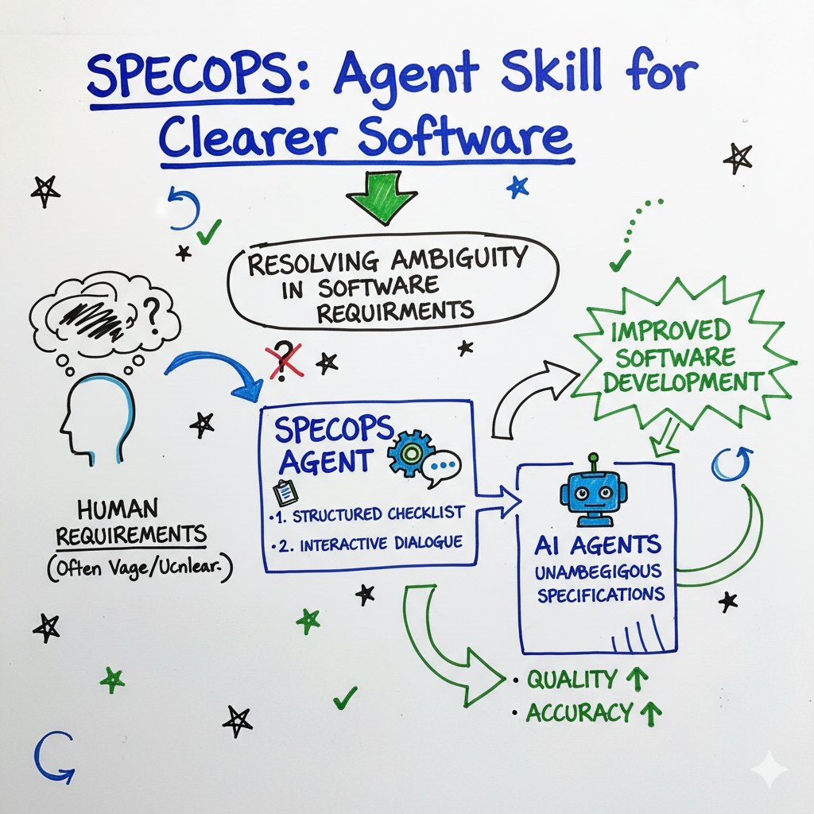

# SpecOps

SpecOps is an Agent Skill for converting ambiguous product requirements into a machine-enforceable contract before implementation starts.

The workflow is markdown-first:
1. Start with a feature spec in Markdown.
2. Have the LLM convert Markdown into Compiled Spec JSON.
3. Run adversarial clarification until ambiguity is removed.
4. Instruct the LLM to plan and generate context-appropriate artifacts from user use case + repository context.



## What This Skill Produces

- A validated `compiled-spec.json` contract
- Context-appropriate artifact set generated in the target repository (for example failing tests, API contract files, fixtures, handoff docs)
- A cleaner handoff to coding agents (implement to satisfy tests)

## Repository Layout

- Skill manifest: [specops/SKILL.md](specops/SKILL.md)
- Runtime workflow: [specops/instructions.md](specops/instructions.md)
- Prompt assets: [specops/prompts/](specops/prompts/)
- JSON schema: [specops/schemas/compiled-spec-schema.json](specops/schemas/compiled-spec-schema.json)
- Examples:
	- Markdown input: [specops/examples/spec-markdown.example.md](specops/examples/spec-markdown.example.md)
	- JSON output target shape: [specops/examples/compiled-spec.example.json](specops/examples/compiled-spec.example.json)

## Prerequisites

- Agent environment that supports Agent Skills (loads `SKILL.md`)
- Permission to read and write files in the target repository

## Install Skill Symlink

Run from this repository root:

```bash
./setup-specops-skill-symlink.sh
```

This creates:

- `~/.agents/skills/specops` -> `<this-repo>/specops`

After this, the skill can be triggered with:

```text
/specops
```

## One-Shot Usage (Recommended)

If you already have a Markdown spec file, run the whole flow from one trigger:

```text
/specops path/to/spec.md
```

Expected behavior:
1. Reads the Markdown spec file.
2. Compiles it into `compiled-spec.json`.
3. Validates the compiled spec.
4. Evaluates current project technology (language/framework/test stack).
5. Generates failing executable contract tests in the project's native test framework.
6. Returns created file paths and scenario coverage summary.

This behavior is defined in:

- [specops/prompts/single_trigger_contract_tests.txt](specops/prompts/single_trigger_contract_tests.txt)

## Detailed Step-by-Step Usage

### Step 1: Activate SpecOps in your agent session

Tell your agent to use SpecOps for requirements compilation, for example:

```text
Use the SpecOps skill for this feature. Start from Markdown spec, compile JSON, clarify ambiguities, then plan and generate context-appropriate artifacts for this repo.
```

The agent should follow [specops/instructions.md](specops/instructions.md).

### Step 2: Create the input Markdown spec

Use [specops/prompts/spec_markdown_template.md](specops/prompts/spec_markdown_template.md) as the required format.

Minimum required sections:
- `Feature`
- `Objective`
- `Actors`
- `Scenarios` (with `Given`, `When`, `Then`)
- `Error and Edge Behavior`
- `Data Models`

If you already have notes/bullets/prose, provide them and instruct the agent to normalize into the template before continuing.

### Step 3: Confirm the Markdown source of truth

Before compiling JSON, ensure the agent confirms:
- the Markdown version to use
- unresolved unknowns it detected
- any assumptions added during normalization

Recommended prompt:

```text
Confirm the normalized Markdown spec first. Then compile it into SpecOps JSON draft.
```

### Step 4: Convert Markdown to Compiled Spec JSON draft

The agent should use [specops/prompts/markdown_to_json_compilation.txt](specops/prompts/markdown_to_json_compilation.txt).

Expected behavior:
- output JSON only
- map scenarios into `scenarios[]`
- map actors into `actors[]`
- map data model fields into `dataModels`
- keep conservative placeholders only when required for structure

### Step 5: Run adversarial clarification loop

The agent should iterate with:
- ambiguity checklist: [specops/prompts/ambiguity_checklist.txt](specops/prompts/ambiguity_checklist.txt)
- question templates: [specops/prompts/clarification_question_templates.txt](specops/prompts/clarification_question_templates.txt)

The loop continues until all completion gates are satisfied:
- no missing `Given/When/Then`
- explicit actor boundaries
- explicit unauthorized/error behaviors
- explicit field constraints where needed
- no contradictions

### Step 6: Compile final JSON and validate shape

The agent should use [specops/prompts/final_spec_formatter.txt](specops/prompts/final_spec_formatter.txt) to produce final JSON that conforms to:

- [specops/schemas/compiled-spec-schema.json](specops/schemas/compiled-spec-schema.json)

Save this as your working contract (for example `compiled-spec.json` in your target repository).

### Step 7: Plan and generate context-aware artifacts

Use context-aware artifact planning instructions in [specops/prompts/context_aware_artifact_planning.txt](specops/prompts/context_aware_artifact_planning.txt).

The LLM must first:
- detect repository stack and conventions from repo evidence
- propose a minimal useful artifact set for this use case
- include artifact paths and acceptance criteria
- request user approval before writing files

For contract-test-first use cases, ensure tests are executable in the existing project framework and remain failing until implementation exists.

Then generate approved artifacts using [specops/prompts/context_aware_artifact_generation.txt](specops/prompts/context_aware_artifact_generation.txt).

Typical artifact types (use-case dependent):
- failing tests (unit/integration/e2e)
- API contract artifacts (OpenAPI/GraphQL snippets)
- test fixtures or seed data
- migration/compatibility notes
- handoff checklist/summary

Recommended prompt:

```text
Build an artifact plan from the compiled spec and this repository context. Propose only relevant artifacts, ask for approval, then generate them using local conventions.
```

### Step 8: Review generated artifacts

Confirm all artifacts match the final contract:
- scenario coverage across artifacts
- status/error behavior representation
- generated files match approved artifact plan

If mismatched, fix the Markdown/JSON spec first, then regenerate.

### Step 9: Handoff to coding agent

When spec and generated artifacts are accepted:
- commit/publish the compiled spec and approved artifacts
- assign coding agent to implement behavior required by the spec and artifacts
- require implementation PR to preserve contract semantics

## Recommended Operator Prompts (Copy/Paste)

```text
Use SpecOps. Start with Markdown spec only. If my input is rough notes, normalize it to the SpecOps markdown template and ask me to confirm.
```

```text
Now convert the confirmed Markdown spec into compiled-spec JSON draft using the SpecOps markdown-to-json compilation prompt.
```

```text
Run the adversarial clarification loop until no ambiguity remains, then produce final schema-valid compiled-spec JSON.
```

```text
After I approve the artifact plan, generate the approved artifacts from the compiled spec using this repository's existing conventions.
```

## Common Pitfalls

- Skipping Markdown confirmation before JSON conversion
- Generating artifacts from an unvalidated or incomplete JSON draft
- Letting ambiguous actor permissions remain unresolved
- Generating artifacts before explicit plan approval
- Producing artifact types that are not relevant to the use case
- Treating generated tests as implementation (they are intentionally failing)

## Skill Manifest

See [specops/SKILL.md](specops/SKILL.md) for activation guidance and [specops/instructions.md](specops/instructions.md) for execution details.